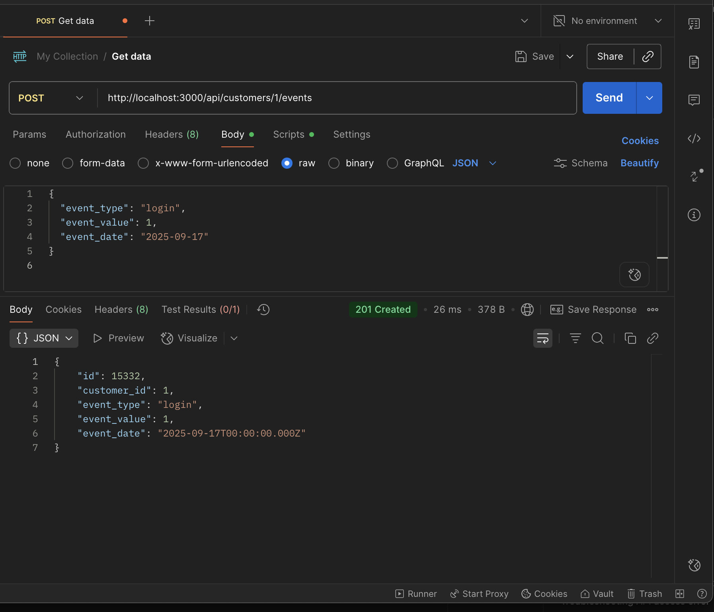
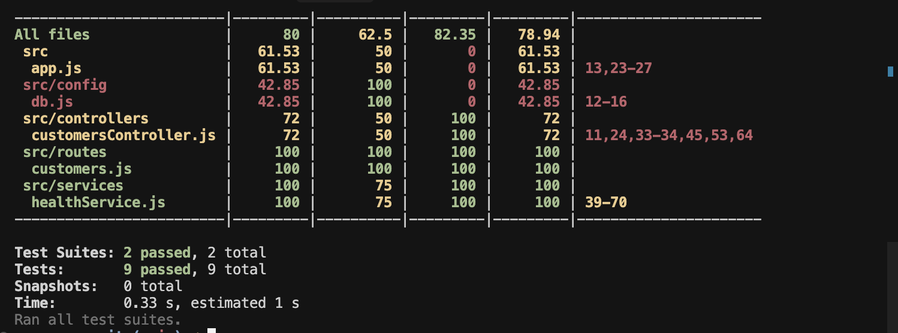

# Customer Health Dashboard

A comprehensive customer health monitoring system that tracks customer engagement, usage patterns, and support interactions to calculate health scores and identify at-risk customers.

## 🚀 Quick Start

### Prerequisites

- Docker and Docker Compose
- Git

### Running the Application

1. **Clone the repository:**

   ```bash
   git clone https://github.com/Bar1996/customer-health
   cd customer-health
   ```

2. **Create environment file:**

   ```bash
   cp .env.example .env.production
   ```

3. **Run the application:**

   ```bash
   docker-compose --env-file .env.production up --build
   ```

4. **Access the application:**
   - Dashboard: http://localhost:3000
   - API: http://localhost:3000/api

## 📊 Features

- **Customer Management**: View all customers with their segments and creation dates
- **Health Score Calculation**: Real-time health scoring based on multiple factors
- **Event Tracking**: Add and track customer events (logins, feature usage, API calls, support tickets, late invoices)
- **Interactive Dashboard**: Modern React-based UI with real-time updates
- **Comprehensive Testing**: Full test coverage for both API and business logic

## 🏗️ Architecture

The application follows a modern microservices architecture:

- **Frontend**: React 19 with Vite, TailwindCSS, and Recharts
- **Backend**: Node.js with Express
- **Database**: PostgreSQL
- **Containerization**: Docker with multi-stage builds
- **Testing**: Jest with Supertest

## 📁 Project Structure

```
customer-health/
├── client/                 # React frontend
│   ├── src/
│   │   ├── components/     # Reusable UI components
│   │   ├── hooks/          # Custom React hooks
│   │   ├── pages/          # Page components
│   │   └── services/       # API service layer
│   └── Dockerfile
├── server/                 # Node.js backend
│   ├── src/
│   │   ├── controllers/    # Request handlers
│   │   ├── services/       # Business logic
│   │   ├── routes/         # API routes
│   │   ├── db/            # Database schema
│   │   └── __tests__/     # Test files
│   └── Dockerfile
├── screenshots/           # Application screenshots
├── docker-compose.yml     # Multi-container setup
└── README.md
```

## 🔧 Development

### Local Development

1. **Backend:**

   ```bash
   cd server
   npm install
   npm run dev
   ```

2. **Frontend:**

   ```bash
   cd client
   npm install
   npm run dev
   ```

3. **Database:**
   ```bash
   docker run -d -p 5432:5432 -e POSTGRES_PASSWORD=postgres postgres:15-alpine
   ```

### Testing

```bash
cd server
npm test
```

## 📈 Health Score Methodology

The health score is calculated based on five key factors:

1. **Login Activity** (25 points): Recent login frequency
2. **Feature Usage** (25 points): Feature adoption and usage
3. **API Engagement** (20 points): API call volume and frequency
4. **Support Tickets** (20 points): Support burden (inverse scoring)
5. **Payment Health** (10 points): Invoice payment timeliness

Scores range from 0-100, with higher scores indicating healthier customer relationships.

## 📸 Screenshots

See the `screenshots/` directory for visual evidence of the running application:

### Dashboard Overview


### Customer Health Score


### Add Event Flow


### API Responses




### Docker Compose & Tests




## 🤖 AI Collaboration

This project was developed with extensive AI assistance using:

- **Cursor**: Primary IDE with AI-powered code completion and refactoring
- **ChatGPT**: Architecture decisions, code review, and documentation generation

Key AI contributions:

- Health score algorithm design and optimization
- React component architecture and state management
- API design and error handling
- Test case generation and coverage
- Documentation and code comments

## 📚 Documentation

- [API Documentation](docs/API.md)
- [Architecture Overview](docs/ARCHITECTURE.md)
- [Health Score Methodology](docs/HEALTH_SCORE.md)
- [Deployment Guide](docs/DEPLOYMENT.md)

## 🛠️ Technology Stack

- **Frontend**: React 19, Vite, TailwindCSS, Recharts, Axios
- **Backend**: Node.js, Express, PostgreSQL, CORS
- **Testing**: Jest, Supertest
- **DevOps**: Docker, Docker Compose
- **Development**: Nodemon
